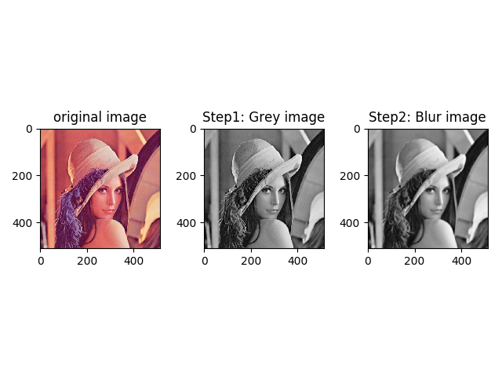
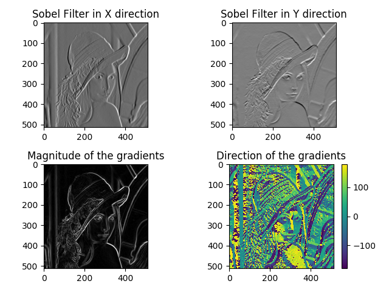
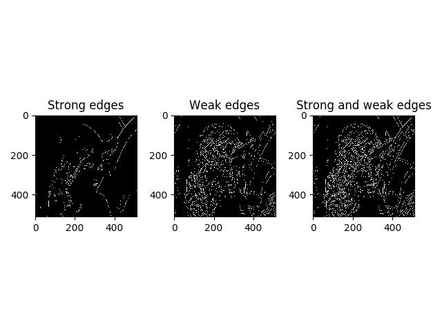
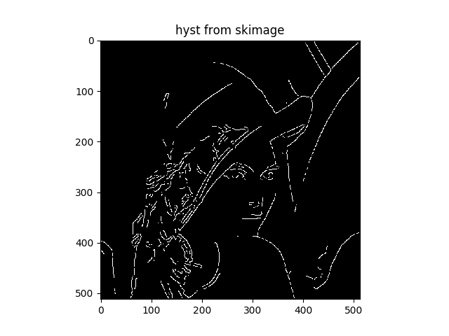
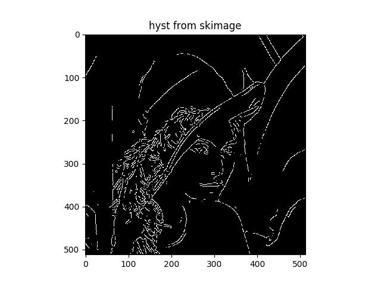
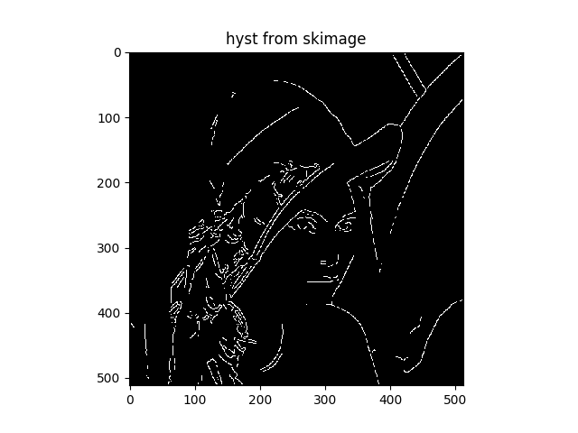

# Canny Edge Detector
Forked and changed from <https://github.com/MadhavEsDios/Canny-Edge-Detector>


An easy to understand implementation of the Canny Edge Detection Algorithm in python

Please refer to this excellent link to better understand the algorithm : "<http://justin-liang.com/tutorials/canny/>"

Important Points:

- I have used a relatively slow iterative approach to perform the function of Double Thresholding Hysterisis, a better and time-saving alternative is to use a recursive algorithm which tracks the edges.
- The value of Sigma to implement Gaussian Blur is image specific, different values can be tested to see which give the best estimate of edges.
- The ratio of the thresholds is again another variable, but the ones that I have used in the code give pretty good estimates for any particular image.
- Non Maxima Suppression with Interpolation although being computationally expensive, gives excellent estimates and is better tha NMS without interpolation

## How to run the code

If you are using python3 you need the following command

```python
python3 CannyEdgeDetector.py param.json
```

There are certain package needed to run the code.

```python
from PIL import Image
from scipy import ndimage
import numpy as np
import matplotlib.pyplot as plt
import argparse
from pathlib import Path
import json
from skimage import filters
```

I compare my method with the skimage package method of doing hysteresis threshold. My method is relatively slow but easy to implement which can be futher improved by keeping track of the edges.

## params file

All the parameter of the algorithm is specified in the param.json file. This is an example:

```json
{
  "image": "Test.png",
  "sigma": 1.8,
  "highThresholdRatio" : 0.3,
  "lowThresholdRatio" : 0.15,
  "uselibrary" : "True",
  "saveoutput" : "True"
}

```


- The image path should be put in "image" item
- The "sigma" is used to blur the image before do sobel operation.
- The parameter of  hysteresis threshold is specified in "highThresholdRatio" and "lowThresholdRatio"
- If "uselibrary" is "True", algorithm will use the skimage library to do the faster hysteresis threshold operation, otherwise is a slower recursive method implemented by me.
- If "saveoutput" is "True", the image file will be output to the "result" folder.

## Test result

### result1

```json
{
  "image": "Test.png",
  "sigma": 1.8,
  "highThresholdRatio" : 0.3,
  "lowThresholdRatio" : 0.15,
  "uselibrary" : "True",
  "saveoutput" : "True"
}

```

Using Lena 512*512 as input


First change it into greyscale image and using gaussian kernel to blur it.

 

We do a sobel edge detection on it and calculate the magnitude and direction of the gradient



Applying hysteresis threshold using parameter specified in the param.json





### Result 2

```json
{
  "image": "Test.png",
  "sigma": 1.4,
  "highThresholdRatio" : 0.2,
  "lowThresholdRatio" : 0.15,
  "uselibrary" : "True",
  "saveoutput" : "True"
}

```



Increase the highThresholdRatio and decrease the lowThresholdRatio, we get:

```json
{
  "image": "Test.png",
  "sigma": 1.4,
  "highThresholdRatio" : 0.3,
  "lowThresholdRatio" : 0.10,
  "uselibrary" : "True",
  "saveoutput" : "True"
}

```




